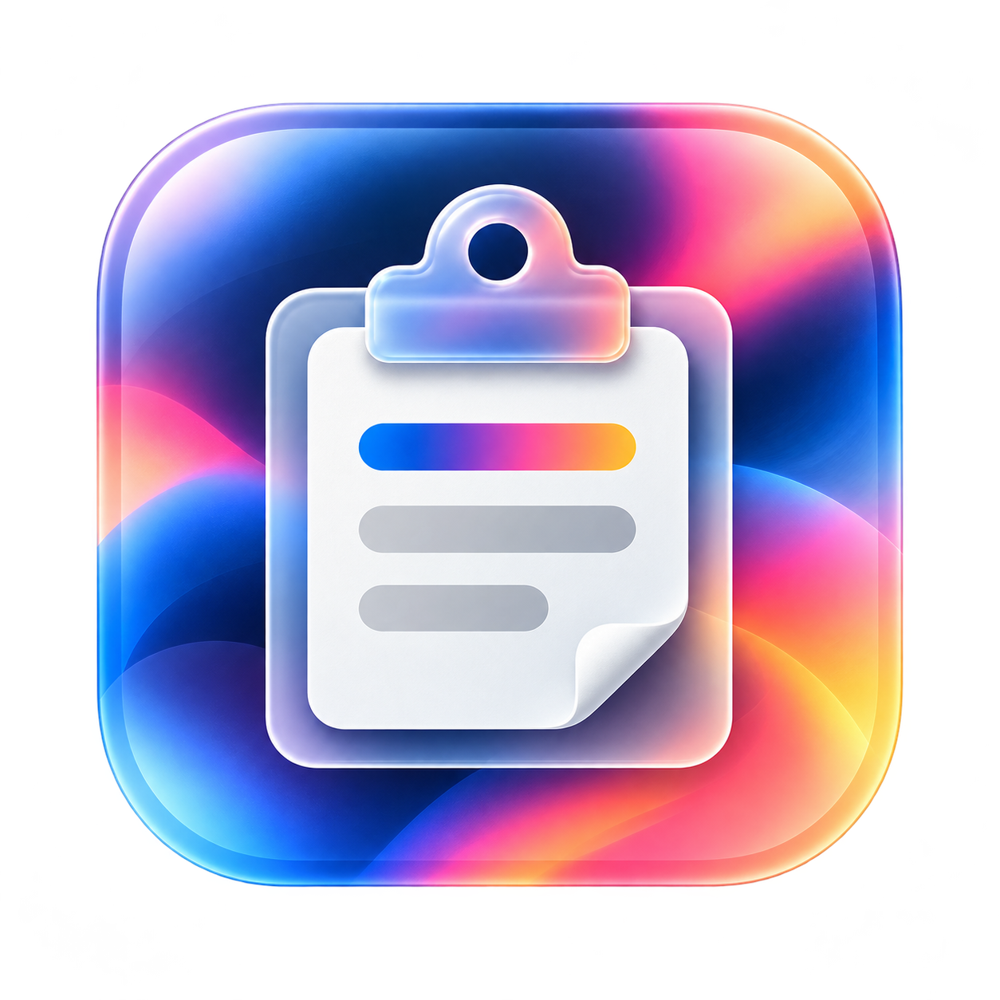

  

<h1 align="center">The Clipboard</h1>

📋 Copy now. Find it later. A little clipboard companion for macOS.

  
  
  

## ✨ Little things, kept handy

- 📋 Native macOS clip collection, saved locally.
- ⚡ A compact, keyboard-driven picker for quick pasting.
- 📝 Keep rich formatting—or paste plain text instead.
- 🔎 Search past clips and browse them in History Manager.
- ⭐ Favorite the things you reach for most.
- 🦋 Sparkle updates, right from the menu bar.
- 🌈 Switch between Dustlight and Lagoon application icons from the menu bar. Your choice sticks across launches.

## ⌨️ Your shortcuts

| Shortcut         | Action                                                    |
| ---------------- | --------------------------------------------------------- |
| ⌥⌘V              | Open the picker                                           |
| ⌃N / ⌃P or ↓ / ↑ | Move through picker results                               |
| Return           | Paste the selected clip                                   |
| ⇧Return          | Paste the selected clip as plain text, when available     |
| ⇧⌘V              | Paste the current clipboard as plain text, when available |
| ⇧⌘Space          | Open History Manager from the picker                      |
| Esc              | Dismiss the picker                                        |

Type in the picker to search. If macOS input-source shortcuts intercept ⇧⌘Space, use **Open History Manager…** from the menu bar.

## 📦 Download

Requires **macOS 26+ and Apple Silicon**. Download [The Clipboard v0.4.1](https://github.com/iomz/TheClipboard/releases/download/v0.4.1/TheClipboard-0.4.1-arm64.dmg), or browse [Releases](https://github.com/iomz/TheClipboard/releases). To build from source, see the [build instructions](DEVELOPMENT.md).

🪴 A fresh application identity with its own clips, favorites and settings. No data or preferences are imported from another app. Allow Accessibility for **The Clipboard** when prompted to paste into other apps.

⚠️ Builds are **development-signed, not Developer ID signed or Apple-notarized**. Gatekeeper may block launch. If blocked, stop rather than bypassing macOS security.

## 🦋 Updating

Sparkle checks The Clipboard's own releases. Choose **Check for Updates…** from the menu bar. Automatic checks are opt-in; downloads and installation remain manual.

## 🛠️ Make yourself at home

Built with SwiftPM and AppKit. See [DEVELOPMENT.md](DEVELOPMENT.md) for building, testing and contributing. Small fixes and thoughtful ideas welcome! 💛

## 🪪 Author & License

**Iori Mizutani** ([@iomz](https://github.com/iomz))

MIT License. See [LICENSE](LICENSE).
